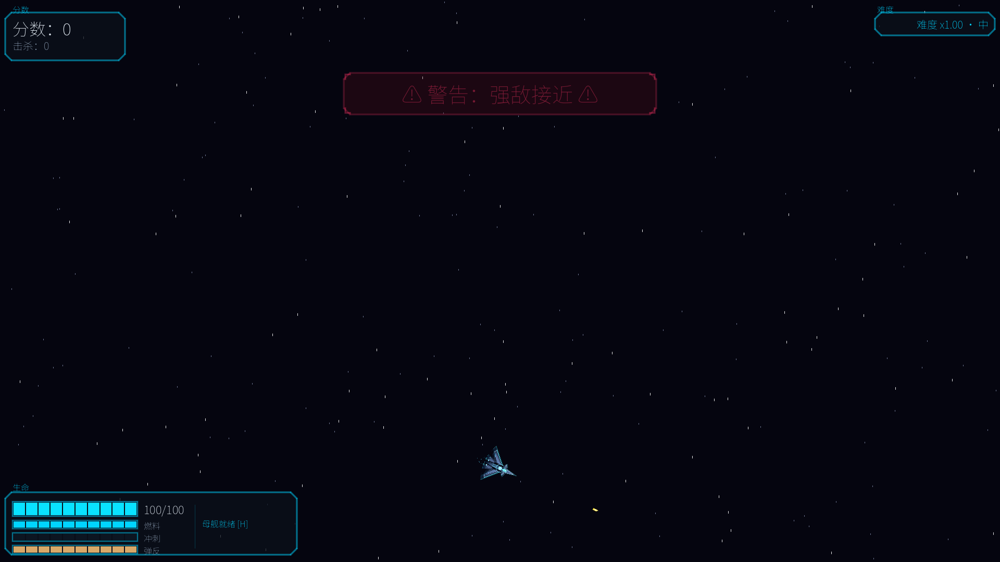
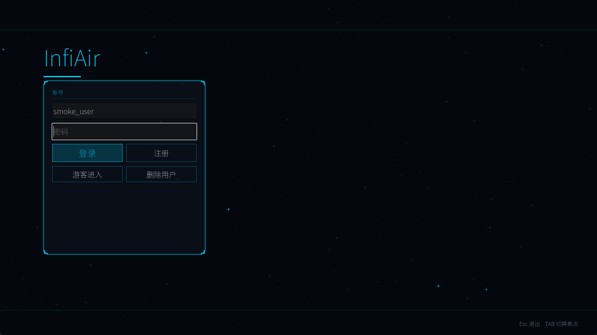
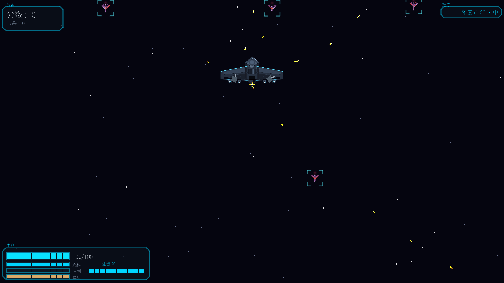
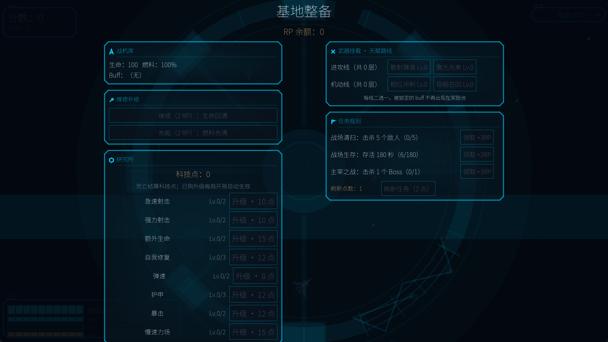

<div align="center">

# 🛩️ InfiAir

**A 2D top-down space shooter built with Godot 4 + GDScript**

**English** · [中文](./README.md)

[](https://godotengine.org/)
[](https://docs.godotengine.org/en/stable/tutorials/scripting/gdscript/)
[](https://github.com/NeverToEver/InfiAir/releases)
[](#-for-developers)
[](#-quick-start)



[🚀 Quick Start](#-quick-start) · [🎮 Controls](#-controls) · [🧭 Game Loop](#-game-loop) · [📁 For Developers](#-for-developers)

</div>

## About

InfiAir is a single-player, score-driven arcade shooter: fight wave-based enemy swarms, draft 1-of-3 buffs at score milestones, and take on rotating bosses — then fly home for a mid-run refit and jump back into the same battle. **Death is the only end.** The difficulty curve grows linearly with no cap: the longer you survive and the more you kill, the deadlier the swarm.

Originally a remake of the Python/Pygame project [airwar-game](https://github.com/NeverToEver/airwar-game), it has since evolved independently. Every sprite and sound is procedurally generated — zero external asset dependencies.

## ✨ Features

**Gameplay**

- 🔄 **A complete sortie loop** — fight waves → draft milestone buffs → boss fights → base refit → sortie again
- 🃏 **16 stackable buffs** — damage / fire rate / spread / piercing / explosive / lifesteal / armor / evasion / phase dash / laser beam…
- 👾 **3 rotating bosses** — driven by an HP-phase pattern table (P1 / P2 / enrage); fail to kill in time and the boss flees
- 🛰️ **Mothership weapons platform** — charge-up summon → auto-docking → piloted stay (WASD + twin turrets + missiles) → tractor-beam recovery
- 💥 **Two random events** — elite turret strikes and formation bombing runs for rhythm-breaking challenges
- 🏠 **Mid-run base refit** — repair / resupply / talent routes / mission rewards, then back to the same battle

**Audiovisuals**

- 🎬 **Two cinematic directors** — a 6-shot launch intro and a 7-shot homecoming return, skippable anytime
- ❤️ **Health-feedback HUD** — hit chromatic aberration / directional ripples / low-HP cracks / vignette heartbeat, with a "reduce flashes" accessibility toggle
- 🎯 **Aim assist** — follow-the-crosshair aiming with enemy aim frames and in-frame homing shots (Low / Medium / High)
- 🎨 **Fully procedural assets** — every sprite, SFX and BGM synthesized by scripts, zero external assets

## 🖼️ Screenshots

| Main menu | Gameplay | Mothership dock | Base refit |
|-----------|----------|-----------------|------------|
|  |  |  |  |

## 🚀 Quick Start

**Just play**: grab a pre-built package from [GitHub Releases](https://github.com/NeverToEver/InfiAir/releases) (Windows / Linux, x86_64) — extract and run, with install/uninstall scripts included. macOS has no pre-built package yet; run from source instead.

**Run from source** (requires [Godot 4.6](https://godotengine.org/download), standard build — no .NET needed):

```bash
git clone https://github.com/NeverToEver/InfiAir.git
cd InfiAir
godot --path .
```

## 🎮 Controls

| Input | Action |
|-------|--------|
| WASD / Arrow keys | Move |
| Mouse | Aim (crosshair inside an aim frame → shots home in on that enemy) |
| — | Weapons fire fully automatically |
| Shift (hold) | Boost (drains fuel) |
| Ctrl (hold) | Precision movement |
| Space | Phase dash (requires buff) |
| H (hold) | Charge-summon the mothership (WASD pilots it while docked) |
| B (hold) | Homecoming — base refit |
| ESC | Pause / back one page / exit confirmation |

<details>
<summary>Full key list (abandon / restart / rebinding)</summary>

- **K (hold 3s)**: abandon the sortie
- **R**: restart (on game-over / pause screens)
- All keys are rebindable in Settings → Controls (Esc / R are fixed; bindings persist). Language (中文 / English), view zoom, window size and aim-assist levels live in Settings → Modes; the Display section also has a "Lock Mouse in Window" toggle (on by default, keeps the cursor inside the window to prevent aim loss, auto-released when switching windows). Each setting persists independently.

</details>

## 🧭 Game Loop

- **Health & score**: start with 100 HP; taking a hit grants invulnerability and clears nearby enemy bullets. Pure score-based — no item drops; death ends the run.
- **Growth**: draft 1-of-3 buffs at score milestones; boss kills and base missions earn RP for repairs and resupply.
- **Pacing**: new enemy classes and elites unlock as your score rises; difficulty grows with no cap as kills and time add up — survive longer, score higher.
- **Saves**: save anytime from the pause menu; homecoming auto-updates the save so you can continue on next launch.
- **Getting started**: the game boots straight to the main menu; a 6-stage tutorial (movement / dash / combat / mothership / homecoming / boss enrage) awaits on first entry.

## 📁 For Developers

<details>
<summary>🏗️ Architecture</summary>

```text
main.tscn (run orchestration)
 ├─ Player (movement / aim assist / auto-fire / fuel / phase dash / laser weapon)
 ├─ Spawner (wave-based spawning + elite / boss / event special-slot scheduling)
 ├─ Mothership (state machine: summon → dock → piloted stay → tractor recovery → depart)
 ├─ Boss (3-type rotation + HP-phase pattern table + per-type enrage)
 ├─ EliteTurretEvent / FormationStrikeEvent (elite turret / formation strike events)
 ├─ IntroCinematic / ReturnCinematic / OrbitalStrike (cinematic & set-piece directors)
 ├─ HUD / BuffSelect / BaseConsole / Pause / Settings / GameOver / StartPanel
 ├─ BackNavigator (global back/exit state machine: PC Esc, gamepad B, Android back)
 └─ GameState (autoload: score / HP / buffs / RP / missions / saves / settings / SFX pool / entity registries)
```

- **Data-driven tuning**: every tunable lives in `data/balance.json`, accessed via `GameState.cfg()` with per-key fallback to script defaults — tweak the JSON, no code changes needed.
- **UI design system**: `scripts/ui_theme.gd` provides color tokens, a type scale and component factories shared by every screen.
- **Performance**: bullet / enemy / explosion object pooling, registries instead of group queries, trig lookup tables, throttled HUD; the `perf_bench` scene measures raw frame time.
- **Collision layers**: `1=player 2=player_bullet 3=enemy 4=enemy_bullet`; bullets resolve damage on their side; hits only count on the r=7 hitbox point.
- **Persistence**: `user://savegame.json` and `user://profile.json` are versioned; corrupted files are quarantined automatically.

</details>

<details>
<summary>✅ Testing (31 scenes / 1092 assertions)</summary>

Tests are headless scene scripts (no framework) that self-check with `[PASS]` / `[FAIL]` output. Minimal verification set:

```bash
godot --headless --import --path .          # assets & script parsing
godot --headless --path . --quit-after 300  # runtime smoke
godot --headless --path . res://test/smoke_test.tscn  # main-flow smoke (142 assertions)
```

The full 31-scene list, the `perf_bench` performance benchmark, the autoplay simulated-play probe and the windowed capture tools are documented in [AGENTS.md](./AGENTS.md).

</details>

<details>
<summary>📚 Documentation</summary>

| Doc | Contents |
|-----|----------|
| [AGENTS.md](./AGENTS.md) | Contributor conventions: tech stack / verification / architecture / code style / test strategy |
| [docs/ROADMAP.md](./docs/ROADMAP.md) | Roadmap and future direction (single source of truth) |
| [docs/EXIT_FLOW.md](./docs/EXIT_FLOW.md) | Back / exit flow |
| [docs/BOSS_REDESIGN.md](./docs/BOSS_REDESIGN.md) | Boss phase pattern tables and enrage design |
| [docs/META_HUD_DESIGN.md](./docs/META_HUD_DESIGN.md) | Meta HUD health feedback design |
| [docs/ELITE_TURRET_EVENT.md](./docs/ELITE_TURRET_EVENT.md) · [docs/FORMATION_STRIKE_EVENT.md](./docs/FORMATION_STRIKE_EVENT.md) | Random event design |
| [docs/INTRO_CINEMATIC.md](./docs/INTRO_CINEMATIC.md) · [docs/RETURN_HOME_CINEMATIC.md](./docs/RETURN_HOME_CINEMATIC.md) | Intro / return cinematic design |
| [docs/ENDLESS_BALANCE_PLAN.md](./docs/ENDLESS_BALANCE_PLAN.md) | Endless-mode difficulty curve plan |

</details>

<details>
<summary>🗺️ Roadmap / 🤝 Contributing / 🙏 Acknowledgments / 📄 License</summary>

**Roadmap**: content evolution (new buffs / new enemy & boss types / mobile controls) is deferred and needs re-proposal to restart; CI and semantic versioning are planned. See [docs/ROADMAP.md](./docs/ROADMAP.md) for details.

**Contributing**: issues and PRs are welcome! Before submitting: make sure all headless assertion scenes pass; follow the conventions in [AGENTS.md](./AGENTS.md); record direction-level decisions (new content, defer / restart) in [docs/ROADMAP.md](./docs/ROADMAP.md) first.

**Acknowledgments**: [airwar-game](https://github.com/NeverToEver/airwar-game) (original prototype) · [Godot-GameTemplate](https://github.com/nezvers/Godot-GameTemplate) · [top-down-shooter-core](https://github.com/quiver-dev/top-down-shooter-core) · [SimpleTopDownShooterTemplate2D](https://github.com/Unchained112/SimpleTopDownShooterTemplate2D) · [Godot-Menus-Template](https://github.com/Maaack/Godot-Menus-Template) · [Godot Engine](https://godotengine.org/) · [Noto Sans SC](https://fonts.google.com/noto/specimen/Noto+Sans+SC) (SIL OFL)

**License**: this repository is currently private and has not chosen an open-source license yet; please contact the author before using or redistributing.

</details>

---

<div align="center">

Maintained as a hobby project — feedback welcome · Made with Godot 4

</div>
