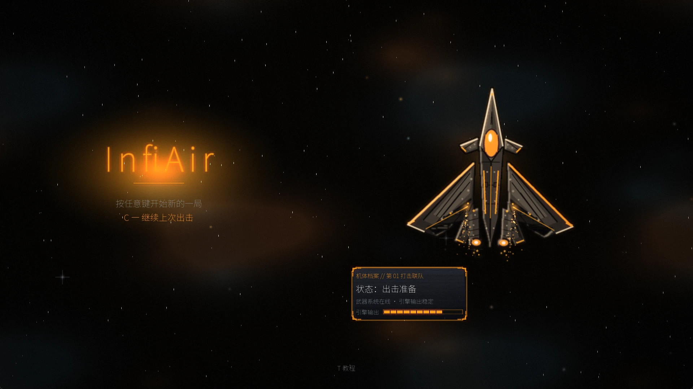
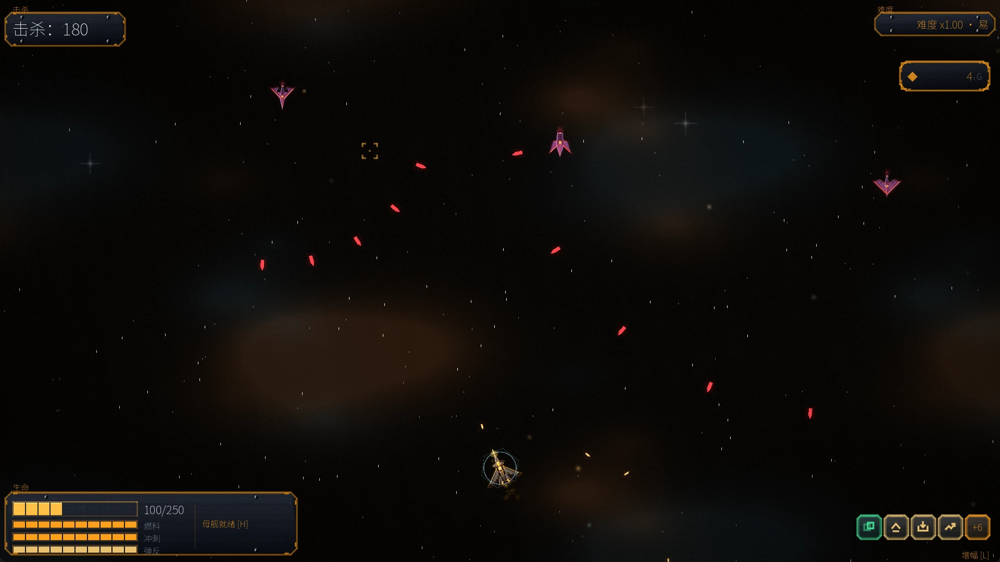
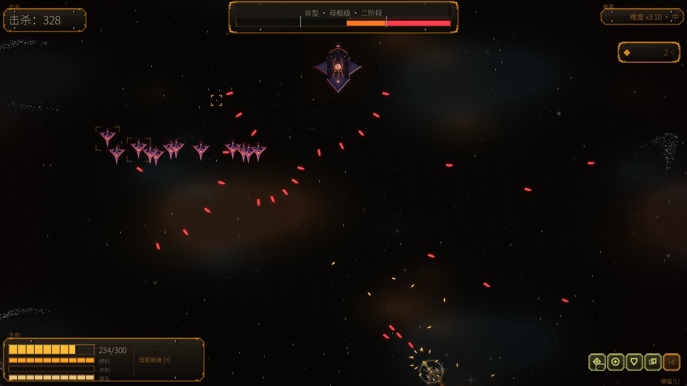
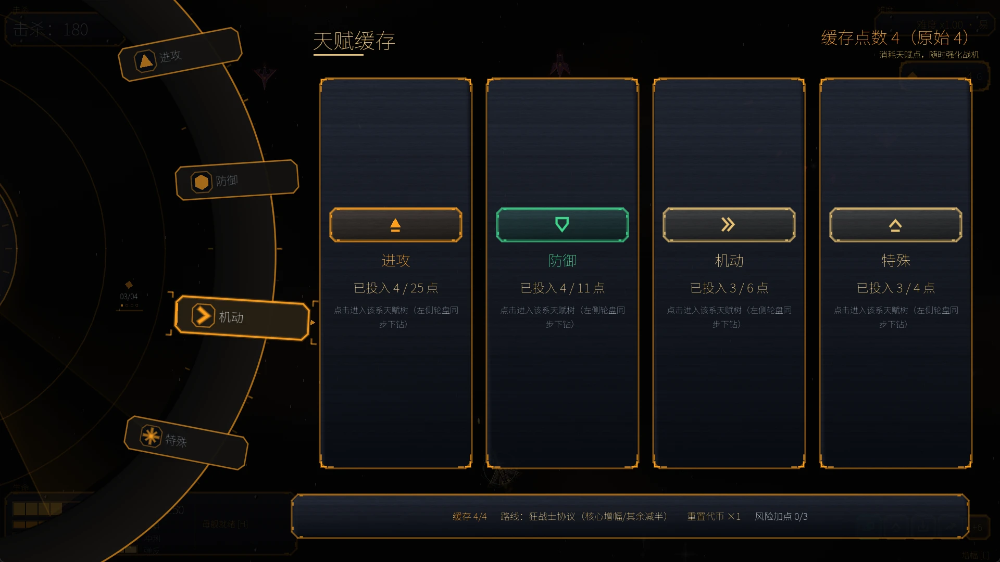
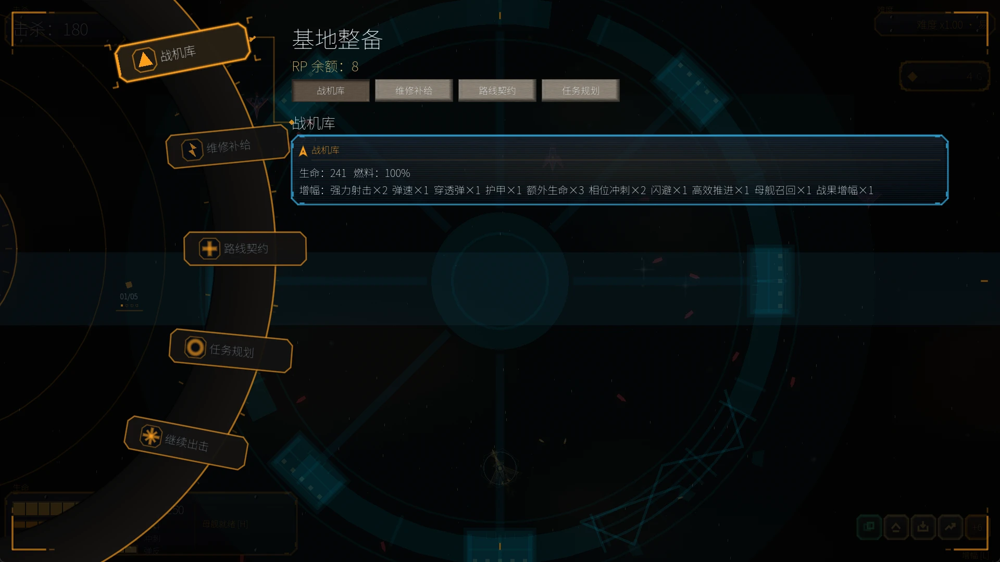

# InfiAir

[](https://github.com/NeverToEver/InfiAir/actions/workflows/ci.yml)
[](https://godotengine.org/download)
[](https://dotnet.microsoft.com/download/dotnet/8.0)
[](LICENSE)

**简体中文** | [English](README_EN.md)

单人 2D 俯视角弹幕射击游戏（shmup），无尽街机流：无登录、无排行榜、无局外成长，开机即玩——成长有界、压力无界，在必死曲线上看你能撑多久。



| | |
| --- | --- |
| 引擎 | Godot 4.6 .NET，全量 C#（零 GDScript），GL Compatibility，1920×1080 |
| 平台 | Windows / Linux 预编译包；macOS 由源码运行 |
| 界面语言 | 简体中文 / English（游戏内切换） |
| 当前版本 | 3.34 |
| 许可证 | [MIT](LICENSE) |

## 截图

| 局内交战 | Boss 遭遇 |
| --- | --- |
|  |  |
| 天赋缓存树 | 黎明站 · 基地整备 |
|  |  |

## 特性

- **本局检查点存档** — 回基地或「保存并退出」自动落盘；死亡或放弃重开即删档——检查点可以续，死了不能读。标题屏「继续上次出击」还原整局进度（分数、难度、天赋、增幅、任务），战场从新一波开始。
- **天赋缓存树** — 里程碑与 Boss 击杀产出天赋点进入缓存池（后进先出、超额衰减），蓄力打开面板自主加点：4 大类 27 节点，派系互斥、专注惩罚、路线契约、风险加点四套机制互相制衡，构筑没有免费午餐。
- **精确的弹幕手感** — 自动开火 + 连击计分（3 秒窗口、最高 ×2）、擦弹得分、360° 弹反把敌弹原样奉还；受击判定只有 2.8px 的核心，宽限期与离场结算保证直击必中、擦边才免。
- **Boss 轮换与遭遇事件** — 4 种 Boss 阶段弹幕 + 狂暴，50 秒打不死就逃逸；精英炮塔、编队突袭、四种干扰雾事件按优先级互斥穿插，同屏不乱套。
- **母舰与黎明站** — 蓄力召唤母舰随行支援（火力平台 + 机库小窗），返回黎明站休整：战机库、维修补给、路线契约、任务规划，用 RP 换资源后继续出击。
- **战术琥珀视觉** — 深炭蓝黑底、琥珀主交互、数据青辅助；世界层手写屏幕后处理（辉光 / 调色 / 晕影 / 颗粒）补足 GL Compatibility；重伤时屏幕碎裂、呼吸与心跳随血量下沉，可一键减弱闪烁。
- **窗口与性能** — 窗口化 / 无边框全屏；渲染分辨率五档（720p / 900p / 1080p / 1440p / 4K，按显示器列档），窗口自由拖拽并记忆任意尺寸；视角三档缩放；帧率上限六档（60 / 120 / 144 / 165 / 180 / 240）+ 垂直同步开关。
- **无尽必死曲线** — 难度随 Boss 击杀与时长无上限爬升，三档难度决定得分倍率（×1 / ×2 / ×3）与节奏；全部数值单源 `data/balance.json`。

## 操作

| 输入 | 功能 |
| --- | --- |
| WASD / 方向键 | 移动（Ctrl 微调，Shift 加速） |
| 鼠标 / 右摇杆 | 瞄准（准星与光标逐像素绑定，永不脱钩） |
| Space | 冲刺 |
| F / LT | 弹反（360° 反弹敌弹） |
| G（按住蓄力） | 天赋面板 |
| H（按住蓄力） | 召唤母舰 |
| B（按住蓄力） | 返回基地 |
| R | 重新出击（暂停页） |
| Esc | 返回 / 暂停 |

标题屏：**任意键**新的一局 · **C** 继续上次出击 · **T** 教程。菜单为左缘圆盘 UI，方向键 / 摇杆旋转、确认键按下。手柄与触屏（虚拟摇杆）均可游玩。

## 运行

### 预编译包

从 [Releases](https://github.com/NeverToEver/InfiAir/releases) 下载 Windows zip / Linux tar.gz。**运行时已随包附带，无需另装 .NET**；解压后直接运行可执行文件，或用包内脚本安装到用户目录：

- Windows：`install.bat`（装到 `%LOCALAPPDATA%\InfiAir` 并建开始菜单项，无需管理员）
- Linux：`./install.sh`（装到 `~/.local/share/infiair` 并写 `.desktop` 桌面项，无需 root）

### 从源码运行

需要 [Godot 4.6+ .NET 版](https://godotengine.org/download)（含 C# 支持，标准版无法打开本工程）；构建 C# 程序集另需 [.NET 8 SDK](https://dotnet.microsoft.com/download/dotnet/8.0)。

- Windows：双击 `run.bat`
- Linux：`./run.sh`（`--editor` 打开编辑器）
- macOS：双击 `run.command`（首次需 `chmod +x run.command`）

启动脚本会自动探测引擎（`godot-mono` → `godot` → `godot4` → `~/.local/bin` → macOS 的 `Godot*.app`）并校验版本（低于 4.6 会告警）。

### 系统要求

- 支持 OpenGL 3.3 的桌面 GPU（GL Compatibility 后端），Windows / Linux / macOS。
- 预编译包自带 .NET 运行时；源码运行需 Godot 4.6+ .NET 版 + .NET 8 SDK。

## 存档与设置

两款档案都落在 Godot 的 `user://` 目录，互不干扰：

| 平台 | 目录 |
| --- | --- |
| Windows | `%APPDATA%\Godot\app_userdata\InfiAir\` |
| Linux | `~/.local/share/godot/app_userdata/InfiAir/` |
| macOS | `~/Library/Application Support/Godot/app_userdata/InfiAir/` |

- `run.json` — 本局检查点（回基地 / 保存并退出写入，死亡或放弃重开删除）。
- `settings.json` — 语言、难度、窗口与分辨率、帧率上限、键位、辅助选项等全部设置；删除即恢复默认。
- `logs/` — 运行日志，排查启动异常时先看这里。

## 常见问题

- **Godot 标准版打不开工程**：本工程含 C#，必须用 .NET 版引擎。
- **启动后闪退 / 只有黑屏**：多为显卡驱动不支持 OpenGL 3.3，或源码运行时 C# 程序集没构建成功（先 `dotnet build`）。日志见 `logs/`。
- **窗口跑到屏幕外或尺寸不合适**：删除 `settings.json` 恢复默认，或在设置页重选窗口分辨率档。
- **想跳过开场过场**：设置 → 操作模式 → 跳过开场过场；过场播放中按任意键也可跳过。
- **不想被闪烁影响**：设置页的「减弱闪烁」开关降低后处理强度。

## 项目结构

```
csharp/core/     纯逻辑层：天赋树、进度曲线、数值与存档模型（不依赖 Godot）
csharp/godot/    Godot 绑定层：场景脚本、UI、服务
scenes/          场景：main / title / tutorial / intro / boss 等
data/            balance.json 数值单源 · translations.csv 双语翻译表
assets/          sprites / 音频 / 字体 / shader
packaging/       发布包内的安装 / 卸载脚本与桌面项
scripts/ci/      CI 门禁脚本
scripts/tools/   素材生成器与数值编辑器（Python）
docs/            设计定稿 · 方向与债务 · README 截图
builds/          导出与打包产物（不入库）
```

## 开发

- **数值调参只改 `data/balance.json`**（可视化编辑：`python3 scripts/tools/balance_editor.py`，仅依赖 Python 标准库）；**全站颜色只改 `csharp/godot/UITheme.cs`**。
- **素材为程序化生成**：`scripts/tools/regenerate_all.sh` 按固定顺序重跑全部生成器（需 Python 3 + Pillow），输出应与仓库现有资产一致——重跑后 `git diff` 为空即正确。
- **构建**：`dotnet build`（零警告口径，`TreatWarningsAsErrors`）。
- **提交前必过的验证门禁与提交信息规范见 [AGENTS.md](AGENTS.md)**；CI 与本地是同一套口径。
- **打包发布**：`./release.sh` 导出 Linux/Windows 并打包到 `builds/release/`；`./release.sh --publish` 继续推送 tag、建 GitHub Release 并上传资产。
- 设计意图见 [DESIGN_BASELINE](docs/DESIGN_BASELINE.md)；方向 / 债务 / 决策索引见 [ROADMAP](docs/ROADMAP.md)。

## 许可证

[MIT](LICENSE)。代码、贴图、音频与着色器均为原创（程序化生成）；唯一第三方素材为 [Noto Sans SC](assets/fonts/NotoSansSC.ttf) 字体（SIL OFL 1.1），详见 [NOTICE](NOTICE)。
